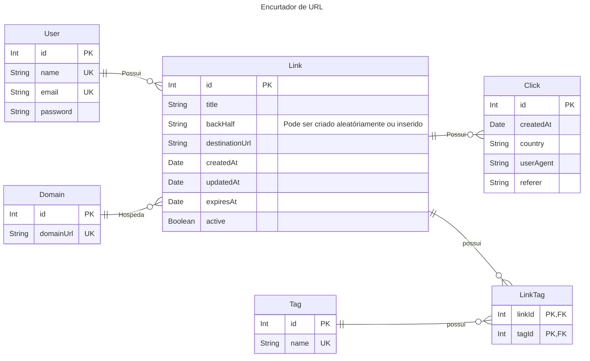

---
title: Encurtador de URL
---

erDiagram direction LR

    User ||--o{ Link : Possui
    Domain ||--o{ Link : Hospeda
    Link ||--o{ Click : Possui
    Link ||--o{ LinkTag : possui
    Tag  ||--o{ LinkTag : possui

    User {
        Int id PK
        String name UK
        String email UK
        String password
    }

    Link {
        Int id PK
        String? title
        String backHalf "Pode ser criado aleatóriamente ou inserido"
        String destinationUrl
        Date createdAt
        Date updatedAt
        Date? expiresAt
        Boolean active
    }
    %% Constraint: UNIQUE(domainId, backHalf)

    Domain {
        Int id PK
        String domainUrl UK
    }

    Tag {
        Int id PK
        String name UK
    }

    LinkTag {
    Int linkId PK, FK
    Int tagId PK, FK
    }

    Click {
    Int id PK
    Date createdAt
    String? country
    String? userAgent
    String? referer

}
