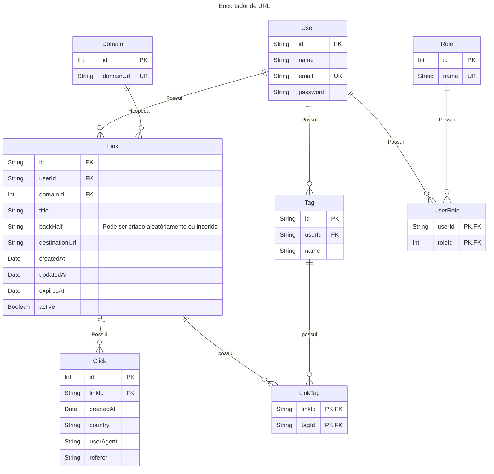

# Modelo de Dados - Encurtador de URL

```mermaid
---
title: Encurtador de URL
---

erDiagram
    direction TB

    User ||--o{ Link: Possui
    Domain ||--o{ Link: Hospeda
    Link ||--o{ Click: Possui
    Link ||--o{ LinkTag: possui
    Tag ||--o{ LinkTag: possui
    User ||--o{ UserRole: Possui
    Role ||--o{ UserRole: Possui
    User ||--o{ Tag: Possui

    User {
        String id PK
        String name
        String email UK
        String password
    }

    Role {
        Int id PK
        String name UK
    }

    UserRole {
        String userId PK, FK
        Int roleId PK, FK
    }

    Link {
        String id PK
        String userId FK
        Int domainId FK
        String title
        String backHalf "Pode ser criado aleatóriamente ou inserido"
        String destinationUrl
        Date createdAt
        Date updatedAt
        Date expiresAt
        Boolean active
    }
%% Constraint: UNIQUE(domainId, backHalf)

    Domain {
        Int id PK
        String domainUrl UK
    }

    Tag {
        String id PK
        String userId FK
        String name
    }
%% Constraint: UNIQUE(userId, name)

    LinkTag {
        String linkId PK, FK
        String tagId PK, FK
    }

    Click {
        Int id PK
        String linkId FK
        Date createdAt
        String country
        String userAgent
        String referer
    }
```
